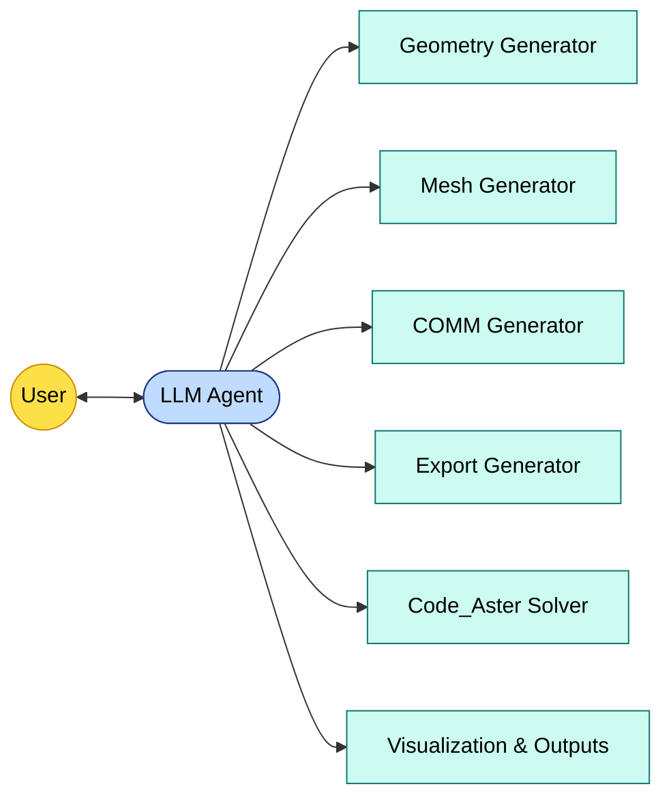

# 🤖 LLM-Driven Code_Aster Automation  
### A Showcase of My Work on AI-Assisted Structural Analysis  
**Amir Yarmohamadi — 2025**

---

## 🚀 Overview

This repository showcases **my technical contributions** to a collaborative project with **Saeideh Mohammadikish**,
where we developed an **LLM-based automation pipeline for the Code_Aster FEM solver** using Python, LangChain, Code_Aster, and Gmsh.

The system enables a user to describe a structural problem **in natural language**, and the pipeline automatically generates:

- geometry (`.geo`)
- mesh (`.med`)
- Code_Aster `.comm` file  
- Code_Aster `.export` file  
- solver execution  
- plots, reactions, and results  

All steps are triggered through an **LLM agent** capable of determining the correct operation at each stage.

The original full project repository (hosted by Saeideh) can be found here:  
👉 [Main Repository](https://github.com/smohammadikish/training)

---

## 🧩 My Main Contributions

Below is a concise and accurate summary of the components I designed and implemented.

---

### 🔹 1. Multi-Stage Architecture Design

I designed the high-level pipeline that transforms a user’s natural-language request into a complete Code_Aster analysis:

1. Parameter extraction  
2. Geometry generation (Gmsh)  
3. Meshing  
4. `.comm` file generation  
5. `.export` creation  
6. Solver execution  
7. Plotting & reaction extraction  

This architecture became the backbone of the system.

---

### 🔹 2. Geometry Generator (Gmsh)

Implemented the complete geometry generation module (`geo_generator.py`):

- automatic beam geometry creation  
- transfinite partitioning  
- structured node generation  
- mm ↔ m conversion logic  
- parameter validation  
- workspace synchronization  

---

### 🔹 3. Mesh Generator

Developed a consistent and error-resistant meshing process:

- structured 1D/2D mesh generation  
- element sizing rules  
- integration with workspace pipeline  
- clear error reporting  

---

### 🔹 4. Code_Aster `.comm` File Generator

One of the most technical and critical components:

- FE model definition  
- material assignment  
- section definition (rectangular)  
- loads and boundary conditions  
- extraction tables (reactions, stresses, displacements)  
- clean and readable command structure  

---

### 🔹 5. Export File Generator

Automated creation of `.export` files with:

- correct path wiring  
- standardized filenames  
- support for multiple runs  
- auto-cleaning and directory initialization  

---

### 🔹 6. AI Integration (LangChain + OpenAI)

I implemented the AI layer responsible for:

- extracting numerical parameters  
- routing tools (geo → mesh → comm → export → solve → visualize)  
- defensive parsing  
- hybrid agent execution mode  
- producing consistent JSON structures  

The agent can operate interactively or in scripted form.

---

### 🔹 7. Workspace Manager

Designed a reproducible workspace layout to keep all generated files organized:

```
workspace/
 ├── model.geo
 ├── model.med
 ├── model.comm
 ├── model.export
 └── results/
```

---

## 🧪 Example Workflow

### User Input

```text
simulate a 5m concrete beam, rectangular section 0.35m x 0.25m,
load 1300 N at the free end
```

### Automated by the LLM:

1. Parameter extraction  
2. Geometry generation  
3. Mesh creation  
4. `.comm` writing  
5. `.export` writing  
6. Code_Aster execution  
7. Plot and result generation  

---



---

## 📌 Features

- Natural-language-driven structural analysis  
- Fully automated FEM pipeline  
- Modular and extensible Python architecture  
- Integration with OpenAI + LangChain  
- Error-aware execution  
- Automatic result plotting  

---

## 📸 Screenshots

```
images/
 ├── pipeline_run.png
 ├── displacement_plot.png
 └── workspace_structure.png
```

---

## 🤝 Collaboration

Developed collaboratively with:

**Saeideh Mohammadikish**

---

## ⭐ Support

If you find this repository useful or inspiring, please consider giving it a ⭐.
